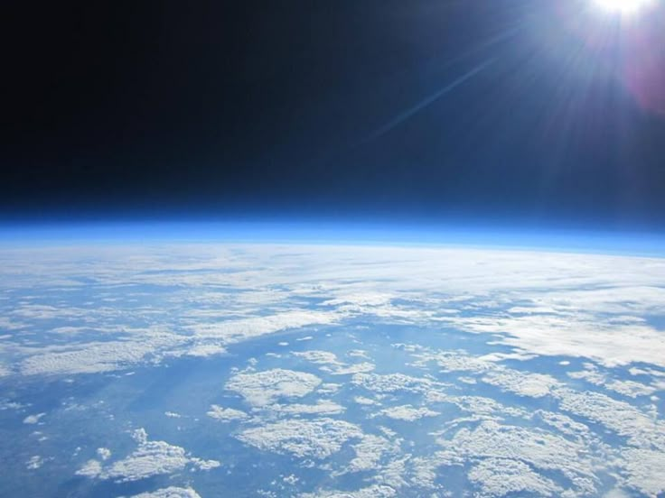

# 🎬 Chroma Keying with OpenCV — Green Screen Replacement


A computer vision project that implements **Chroma Keying (Green Screen Matting)** from scratch using OpenCV and NumPy. This technique — routinely used in the film and television industry — detects and removes a solid green background from a video and replaces it with any custom image or video of your choice.

> 🚀 **Demo Result:** Asteroids originally shot against a green screen are composited onto a deep-space universe background, producing a seamless space scene!

---

## 🎥 Demo

### Step 1 — Input: Asteroid on Green Screen
> *Raw footage — asteroid moving against a solid green background*


---

### Step 2 — Background Image: Universe
> *The replacement background — a deep space image*



---

### Step 3 — Output: Asteroid Flying Through Space 🌌
> *Final composited result after chroma keying*


---

## 📖 Table of Contents

- [Background](#-background)
- [How It Works](#-how-it-works)
- [Project Structure](#-project-structure)
- [Requirements](#-requirements)
- [Setup & Installation](#-setup--installation)
- [Usage](#-usage)
- [Algorithm Details](#-algorithm-details)
- [Controls & Interface](#-controls--interface)
- [References](#-references)
- [Contributors & Acknowledgements](#-contributors--acknowledgements)
- [License](#-license)

---

## 🧠 Background

**Chroma Keying** is a visual effects technique that has been used since the mid-1960s. The idea is simple but powerful:

- A subject (actor, object, etc.) is filmed in front of a **solid-colored background** — historically blue, but now almost universally **green**.
- In post-production (or in real time), the background color is detected and **replaced** with any image or video.
- Green replaced blue because green clothing is far less common, reducing accidental removal of the subject.

This project implements chroma keying entirely from scratch using OpenCV — no external compositing software required.

---

## ⚙️ How It Works

The core pipeline applied to every frame:

```
Input Frame (BGR)
      │
      ▼
Convert to HSV Color Space
      │
      ▼
Apply Median Blur  (noise reduction)
      │
      ▼
Threshold Green Color Range  →  Binary Mask
      │
      ▼
Morphological Opening  (remove small noise blobs)
      │
      ▼
Dilation  (smooth mask edges)
      │
      ▼
Apply Mask to Background Image
      │
      ▼
Zero-out Green Regions in Foreground Frame
      │
      ▼
Add Background Layer + Foreground Layer  →  Final Composite
      │
      ▼
Write to Output Video
```

---

## 📁 Project Structure

```
chroma-keying-opencv/
│
├── chroma_key.py             # Main script
├── requirements.txt          # Python dependencies
├── README.md                 # Project documentation
│
├── assets/                   # GIFs and images used in this README
│   ├── asteroid_greenscreen.gif      # Input: asteroid on green screen
│   ├── universe_background.jpeg      # Background: universe image
│   └── asteroid_final.gif            # Output: asteroid in space
│
├── inputs/                   # Your source files (not tracked by git)
│   ├── greenscreen-demo.mp4
│   ├── greenscreenAsteroid.mp4
│   ├── zoomBg.jpeg
│   └── universe.jpeg
│
└── outputs/                  # Generated output videos (not tracked by git)
    ├── greenScreenFinal.mp4
    └── asteroidFinal.mp4
```

> **Note:** `inputs/` and `outputs/` are listed in `.gitignore` because video files are too large for GitHub.
> Upload your demo GIFs to the `assets/` folder — they are small enough to commit directly.

---

## 🛠️ Requirements

- Python 3.x
- OpenCV
- NumPy

Install all dependencies with:

```bash
pip install -r requirements.txt
```

---

## 🚀 Setup & Installation

**1. Clone the repository:**

```bash
git clone https://github.com/your-username/chroma-keying-opencv.git
cd chroma-keying-opencv
```

**2. Install dependencies:**

```bash
pip install -r requirements.txt
```

**3. Add your input files** into the `inputs/` folder:
   - A `.mp4` video of a subject on a green screen
   - A `.jpeg` / `.png` background image to replace the green screen with

**4. Update file paths** in the `CONFIG` block at the top of `chroma_key.py`.

**5. Run the script:**

```bash
python chroma_key.py
```

---

## 🎮 Usage

### Configuring Inputs

All file paths and settings live in the `CONFIG` dictionary at the top of `chroma_key.py` — no need to dig into the logic:

```python
CONFIG = {
    "video1": {
        "input_video"  : "inputs/greenscreen-demo.mp4",
        "background"   : "inputs/zoomBg.jpeg",
        "output_video" : "outputs/greenScreenFinal.mp4",
        "fps"          : 30,
    },
    "video2": {
        "input_video"  : "inputs/greenscreenAsteroid.mp4",
        "background"   : "inputs/universe.jpeg",
        "output_video" : "outputs/asteroidFinal.mp4",
        "fps"          : 25,
    },

    # Tune these HSV bounds to match your specific green screen shade
    "lower_green" : [36, 120,  70],
    "upper_green" : [80, 255, 255],
}
```

### Tuning the Green Range

The HSV thresholds control what counts as "green screen." Adjust if your results show ghosting or missing pixels:

| Parameter | Channels | Default |
|---|---|---|
| `lower_green` | `[Hue, Saturation, Value]` | `[36, 120, 70]` |
| `upper_green` | `[Hue, Saturation, Value]` | `[80, 255, 255]` |

> **Tip:** Visualize `cv2.inRange` output as a grayscale window during development to fine-tune these bounds for your footage.

---

## 🔬 Algorithm Details

### 1. Color Space Conversion — BGR → HSV

Green is far easier to isolate in **HSV (Hue, Saturation, Value)** space than in raw BGR, because hue is decoupled from brightness — making detection robust to lighting variations.

```python
hsv = cv2.cvtColor(frame, cv2.COLOR_BGR2HSV)
```

### 2. Noise Reduction — Median Blur

Median blur suppresses pixel-level noise before thresholding without smearing object edges.

```python
blurred = cv2.medianBlur(hsv, 3)
```

### 3. Green Mask — `cv2.inRange`

Pixels within the defined HSV green range become white (255); everything else becomes black (0).

```python
mask = cv2.inRange(blurred, lower_green, upper_green)
```

### 4. Mask Cleanup — Morphological Operations

- **Opening** (`MORPH_OPEN`) — removes small isolated noise pixels inside the mask.
- **Dilation** — slightly expands the mask outward to cover fringe and edge pixels.

```python
kernel = np.ones((3, 3), np.uint8)
mask   = cv2.morphologyEx(mask, cv2.MORPH_OPEN, kernel)
mask   = cv2.dilate(mask, kernel, iterations=2)
```

### 5. Compositing

- The **background** is masked to show only through detected green regions.
- The **foreground frame's** green pixels are zeroed out.
- Both layers are **added** together to produce the final composite.

```python
bg_layer             = cv2.bitwise_and(background, background, mask=mask)
fg_layer             = frame.copy()
fg_layer[mask > 100] = (0, 0, 0)
final                = cv2.add(bg_layer, fg_layer)
```

---

## 🎛️ Controls & Interface

As specified in the project brief, the following interactive controls are supported (implemented via OpenCV HighGUI `cv2.createTrackbar()`):

| Control | Description |
|---|---|
| **Color Patch Selector** | Select a rectangular patch from a video frame to sample the target green color |
| **Tolerance Slider** | Widens or narrows the HSV threshold around the sampled green mean |
| **Softness Slider** *(optional)* | Controls mask edge softness via blur kernel size |
| **Color Cast Removal** *(optional)* | Reduces green color spill cast onto the subject from the screen |

---

## 📚 References

1. **Blue Screen Matting** — Smith, A. R. & Blinn, J. F. (1996)
   Foundational paper on chroma matting by Pixar co-founder Alvy Ray Smith (two-time Technical Oscar winner) and Jim Blinn.
   🔗 [https://dl.acm.org/doi/10.1145/237170.237176](https://dl.acm.org/doi/10.1145/237170.237176)

2. **Robust Chroma Keying System based on Human Visual Perception and Statistical Color Models**
   Academic paper covering statistical and perceptual approaches to green screen segmentation.
   🔗 [https://ieeexplore.ieee.org/document/1315080](https://ieeexplore.ieee.org/document/1315080)

3. **Background Matting V2 — State of the Art by Disney Research / University of Washington**
   High-fidelity, non-real-time compositing research. See also the [demo video](https://youtu.be/oVrY4KgcHcE).
   🔗 [https://grail.cs.washington.edu/projects/background-matting-v2/](https://grail.cs.washington.edu/projects/background-matting-v2/)

4. **OpenCV Docs — Color Spaces**
   🔗 [https://docs.opencv.org/4.x/df/d9d/tutorial_py_colorspaces.html](https://docs.opencv.org/4.x/df/d9d/tutorial_py_colorspaces.html)

5. **OpenCV Docs — Morphological Transformations**
   🔗 [https://docs.opencv.org/4.x/d9/d61/tutorial_py_morphological_ops.html](https://docs.opencv.org/4.x/d9/d61/tutorial_py_morphological_ops.html)

---

## 🤝 Contributors & Acknowledgements

**Author:** [Vishwanath Reddy](https://github.com/your-username)

**Course:** This project was completed as part of a hands-on computer vision curriculum.
Special thanks to **[OpenCV University](https://opencv.org/university/)** for the project specification, reference materials, and course content that guided this implementation.

> *"Chroma keying is one of the most elegant demonstrations of color space mathematics applied to the real world."*

---

## 📄 License

This project is licensed under the [MIT License](LICENSE).

---

<p align="center">Made with ❤️ and lots of green pixels</p>
